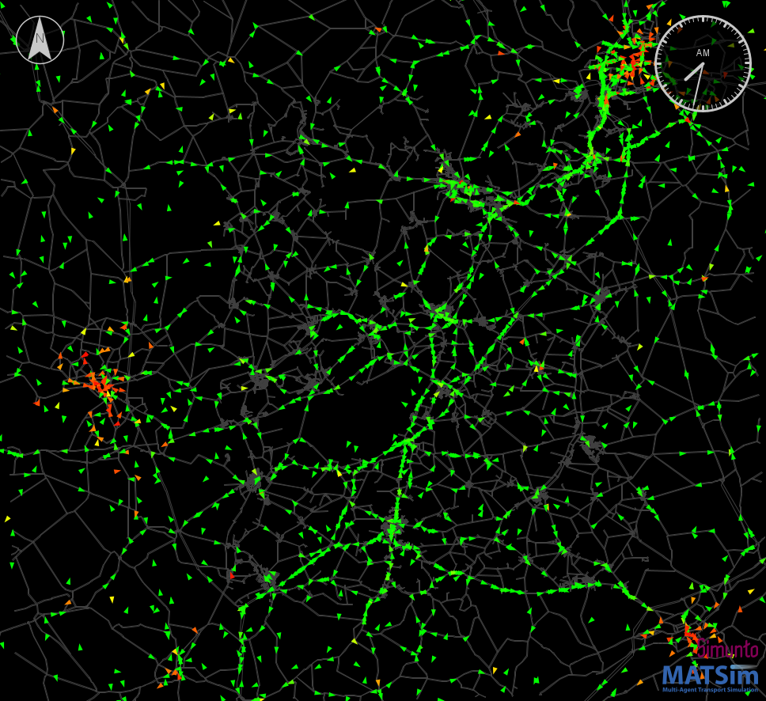
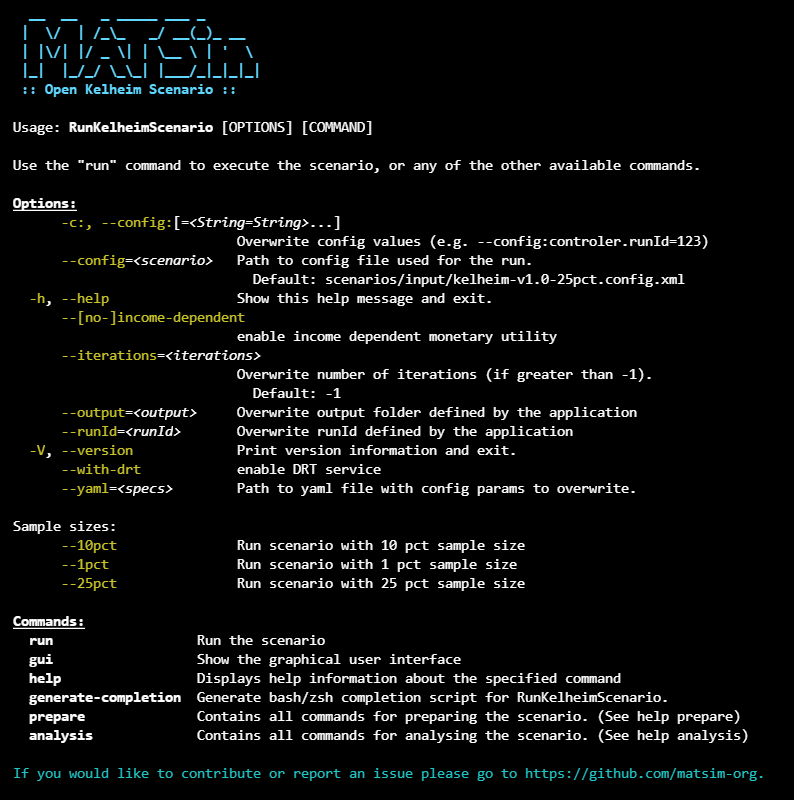

# The MATSim Open Kelheim Scenario

### About this project

This repository provides an open MATSim transport model for Kelheim, provided by the [Transport Systems Planning and Transport Telematics group](https://www.tu.berlin/vsp) of [Technische Universität Berlin](http://www.tu-berlin.de).

This scenario contains a 25pct sample of Kelheim and its surrounding area; road capacities are accordingly reduced. The scenario is calibrated taking into consideration the traffic counts, modal split and mode-specific trip distance distributions.

### Licenses

The **MATSim program code** in this repository is distributed under the terms of the [GNU General Public License as published by the Free Software Foundation (version 2)](https://www.gnu.org/licenses/old-licenses/gpl-2.0.en.html). The MATSim program code are files that reside in the `src` directory hierarchy and typically end with `*.java`.

The **MATSim input files, output files, analysis data and visualizations** are licensed under a <a rel="license" href="http://creativecommons.org/licenses/by/4.0/">Creative Commons Attribution 4.0 International License</a>.
  MATSim input files are those that are used as input to run MATSim. They often, but not always, have a header pointing to matsim.org. They typically reside in the `scenarios` directory hierarchy. MATSim output files, analysis data, and visualizations are files generated by MATSim runs, or by postprocessing.  They typically reside in a directory hierarchy starting with `output`.

**Other data files**, in particular in `original-input-data`, have their own individual licenses that need to be individually clarified with the copyright holders.

The input plans (person transport demand) for this project were generated based on data provided by [Senozon AG](https://senozon.com/).

### Note (where to find input and output)

Handling of large files within git is not without problems (git lfs files are not included in the zip download; we have to pay; ...).  In consequence, large files, both on the input and on the output side, reside at [the public matsim-kelheim data repo](https://svn.vsp.tu-berlin.de/repos/public-svn/matsim/scenarios/countries/de/kelheim).

----
### Run the MATSim Kelheim scenario

The Kelheim scenario has a command line interface providing the following options:

It can be used by using either of these methods:

##### ... using an IDE, e.g. Eclipse, IntelliJ - Alternative 1: use cloned/downloaded matsim-kelheim repository
(Requires either cloning or downloading the repository.)

1. Set up the project in your IDE.
1. Make sure the project is configured as maven project.
1. Run the JAVA class `src/main/java/org/matsim/run/RunKelheimScenario.java` with the following program argument `run`.
   1. Add '--1pct' for test runs with a smaller sample size. Be aware that the model is calibrated with 25 pct, and outputs for 1 pct might be a little off.
1. "Open" the output directory.  You can drag files into VIA as was already done above.
1. Edit the config file or adjust the run class. Re-run MATSim.

##### ... using a runnable jar file
(Requires either cloning or downloading the repository and java)

1. Open the cmd and go to your project directory
2. Build the scenario using `mvnw package`. Add the option `-Dskiptests=true` in order to skip tests and speed up the process. 
3. There should be a file directly in the `matsim-kelheim` directory with name approximately as `matsim-kelheim-3.x-SNAPSHOT-<commitId>.jar`.
4. Run this file from the command line using `java -jar matsim-kelheim-3.x-SNAPSHOT-<commitId>.jar --help` to see all possible options.
  1. For example, one can disable lanes or run smaller sample sizes using the available options
5. Start this scenario using the default config by running `java -jar matsim-kelheim-3.x-SNAPSHOT-<commitId>.jar`.
   1. If you want to run the scenario somewhere else, e.g. on a computation cluster, make sure to not only copy the jar but also the 'input' directory and put it right next to the jar.
6. "Open" the output directory. 
   1. You can drag files into VIA as was already done above.
   2. You can also browse the output directory on vsp.berlin/simwrapper and analyze some of your results with interactive dashboards.

----
### Results and analysis

Here are the most common ways to analyse and visualize the results (and inputs):

1. [Simunto VIA](https://www.simunto.com/via/)
2. [SimWrapper](https://www.vsp.berlin/simwrapper) 
   1. (use Google for the best experience)
   2. Browse your local output directory or [the public matsim-kelheim data repo](https://vsp.berlin/simwrapper/public/de/kelheim) 
   2. Explore and create many interactive visualisations and dashboards
3. Analysis the output .csv tables using the R language and [the matsim-r package](https://github.com/matsim-vsp/matsim-r)

If you have questions, feel free to contact us [(VSP)](https://www.tu.berlin/vsp) any time  :)

---
## More information

For more information about MATSim, see here: https://www.matsim.org/
## Internal documentation

Internal documentation can be found here:
https://docs.google.com/document/d/1xOkHVUKVLrtliVS4Y8ITz6zs_wQE6BG2-Cdmhw-HKgQ/edit?usp=drive_link
